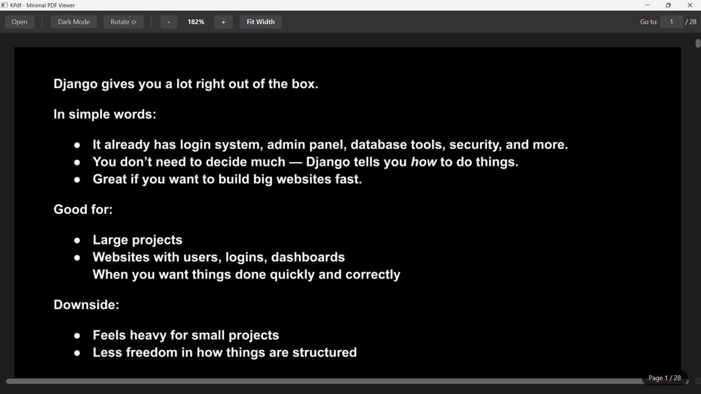

Here is a professional and comprehensive `README.md` for your project. You can copy-paste this directly into your repository.

---

# KPdf - Minimal PDF Viewer



KPdf is a lightweight, high-performance PDF viewer built with **JavaFX** and **Apache PDFBox**. It is designed for speed and reading comfort, featuring a GPU-accelerated Dark Mode, smooth zooming, and essential navigation tools without the bloat of traditional PDF readers.

---

## 🚀 Features

* **⚡ Fast Rendering:** Optimized asynchronous loading prevents UI freezes, even with large files.
* **🌙 True Dark Mode:** Smart pixel-inversion technology that turns white backgrounds black and black text white—perfect for late-night reading.
* **🔍 Smart Zoom:** Smooth scaling from 10% to 500% with a "Fit to Width" shortcut.
* **⟳ Rotation Support:** Rotate pages 90° clockwise to fix sideways scans or landscape documents.
* **Hash Navigation:** Jump instantly to any page using the "Go to" input.
* **Clean UI:** A modern, distraction-free interface with a floating toolbar and status indicators.

---

## 🛠️ Built With

* **[JavaFX](https://openjfx.io/)** (UI Framework)
* **[Apache PDFBox](https://pdfbox.apache.org/)** (PDF Rendering Engine)
* **[Maven](https://maven.apache.org/)** (Dependency Management)

---

## ⚙️ Prerequisites

* **Java JDK 17** or higher (Required for modern JavaFX)
* **Maven 3.6+**

---

## 📦 Installation & Running

1. **Clone the Repository**
```bash
git clone https://github.com/yourusername/kpdf.git
cd kpdf

```


2. **Build with Maven**
```bash
mvn clean install

```


3. **Run the Application**
```bash
mvn javafx:run

```


---

## 🎮 Usage Guide

| Feature | Action |
| --- | --- |
| **Open File** | Click `Open` or press `Ctrl+O`. |
| **Dark Mode** | Toggle the `Dark Mode` button to invert colors. |
| **Zoom** | Use `+` / `-` buttons or `Ctrl + Scroll`. |
| **Fit Width** | Click `Fit Width` to instantly match the window size. |
| **Rotate** | Click `Rotate ⟳` to turn pages 90° clockwise. |
| **Jump to Page** | Type a number in the "Go to" box and press `Enter`. |

---

## 🔧 Technical Details (For Developers)

### Project Structure

```
src/main/java/dev/kpdf/
├── Main.java              # Application Entry Point
├── PdfViewer.java         # UI Layout & Interaction Logic
└── PdfRendererService.java # PDFBox Rendering & Pixel Manipulation

```

### Key Optimizations

* **Pixel-Level Inversion:** Instead of using JavaFX `BlendMode` (which can cause artifacts), KPdf manually manipulates the RGB bytes of the rendered image buffer for a flawless Dark Mode.
* **Background Threading:** All PDF rendering happens on a separate `ExecutorService` thread pool to keep the GUI responsive.
* **Memory Management:** Images are rendered on-demand to handle large documents efficiently.

---

## 🤝 Contributing

Contributions, issues, and feature requests are welcome!

1. Fork the Project
2. Create your Feature Branch (`git checkout -b feature/AmazingFeature`)
3. Commit your Changes (`git commit -m 'Add some AmazingFeature'`)
4. Push to the Branch (`git push origin feature/AmazingFeature`)
5. Open a Pull Request

---

## 📄 License

Distributed under the **MIT License**. See `LICENSE` for more information.

---

**Created with ❤️ by Kaushal Prakash**